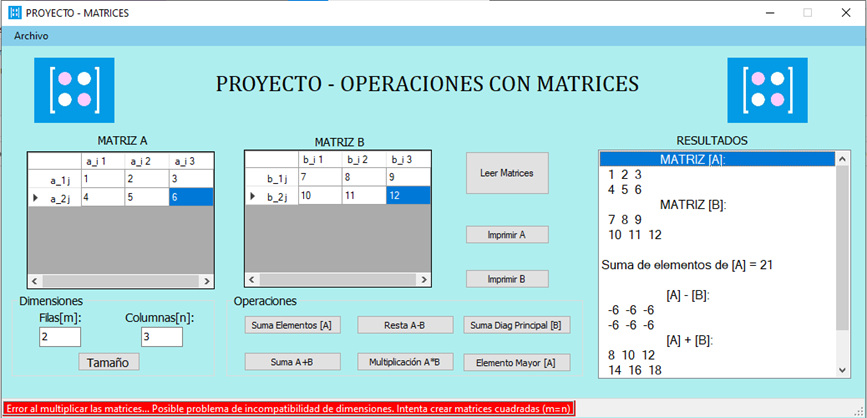

<div align="center" id="top"> 
  

  &#xa0;
</div>

<h1 align="center">Herencia Arrays WinForms</h1>

<p align="center">
  

  

  

  
</p>


<p align="center">
  <a href="#dart-description">Description</a> &#xa0; | &#xa0; 
  <a href="#sparkles-features">Features</a> &#xa0; | &#xa0;
  <a href="#white_check_mark-requirements">Requirements</a> &#xa0; | &#xa0;
  <a href="#checkered_flag-starting">Starting</a> &#xa0; | &#xa0;
  <a href="#wrench-support">Support</a> &#xa0; | &#xa0;
  <a href="#memo-license">License</a> &#xa0; | &#xa0;
  <a href="https://github.com/AlexisCastro12" target="_blank">Author</a>
</p>

<br>

## :dart: Description ##

Herencia Arrays WinForms is an application programmed using C# and the .NET framework (4.7) with Windows Forms in the Visual Studio 2019 development environment that takes advantage of the concepts of object-oriented programming and multithreading (multithreading) as well as external tools to the IDE as the office package to generate and capture data in real time.

This project facilitates the calculation of multiple analog-to-digital (A/D) converters. It also allows to identify the effects of variations of the parameters involved in this type of systems. Some of these parameters that can be modified are the input voltage and the number of bits through the graphical interface. However, it is possible to modify other variables from the program source code.

Primarily, this application is useful for engineering students who are beginning to enter the world of digital signal processing. However, it also serves as a guide for programmers who need to learn how to capture data generated by a WinForms application in a temporary file in a simple way.

## :sparkles: Features

Currently, the characteristics that this project has are:

:heavy_check_mark: A graphical interface with Radiobuttons to select the number of bits to represent a data and with Textboxes that only allow numeric entries to enter the input voltage to be converted.

:heavy_check_mark: There is a button to start and end the conversion process. Each process is a complete cycle.

:heavy_check_mark: It is possible to modify the input data (bits and voltage) before, during and after each conversion cycle. However, only the data that was present after the start and before the end of the process is captured.

:heavy_check_mark: The generated data is periodically captured in an Excel file that can be accessed after completing a conversion cycle by clicking on the Excel logo image.

:heavy_check_mark: Each time you start a conversion cycle the excel file is overwritten and the data from the previous cycle is lost.

The initial objetive of this project is to apply the concept of multithreading in programming and learn how to capture data generated in real time for further analysis. So far, this task has been accomplished, however there are many areas of opportunity to scale this application and give it greater functionality. Some proposals for future enhancements are:

:pushpin: Create an interface to receive real analog signals from an external circuit through a computer port.

:pushpin: Each user can create as many converters as he wants limiting it to an arbitrary number to avoid any collapse of his computer by the excessive use of memory.

:pushpin: Each user decides whether the output data should be in a single excel document or in separate files.

## :white_check_mark: Requirements

Before starting :checkered_flag:, you need to have [Git](https://git-scm.com) installed.

Remember that the application can only be run on Windows OS :computer:.

## :checkered_flag: Starting

```bash
# Clone this project
$ git clone https://github.com/AlexisCastro12/Herencia-Arrays-WinForms.git

```

Find the folder in the path where the clone was made and go to './bin/Debug/' and run as administrator the application Practica3_Threads_9CM11.exe.

Initially, the voltage is set to 0.0000 and the bits are set to 8 for all converters. Also, no conversion cycle is active.

Modify the parameters as needed and start the conversion cycle with the 'Iniciar' button at any time.

There is a preloaded Excel file that has junk data and are the ones you will see if you have not yet started a conversion cycle.


## :wrench: Support ##

If you have problems with the project or need additional information, please contact me at <alexis1204.aacs@gmail.com> :e-mail:.

## :memo: License ##

This project is under license from MIT. For more details, see the [LICENSE](LICENSE) file.


Made with :heart: by <a href="https://github.com/AlexisCastro12" target="_blank">AlexisCastro12</a>

&#xa0;

<a href="#top">Back to top</a>
